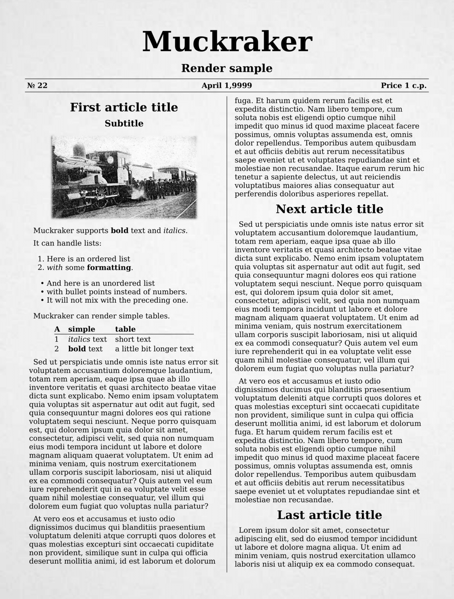

# Muckraker
A vintage gazette generator for creative projects.

Available as [a web tool](http://muckraker.kmiziz.xyz).

## Acknowledgements
Muckraker uses a long list of amazing packages, libraries and tools.
Some of them are listed in the `requirements.txt` file.

Special mentions:
- [Python-Markdown](https://github.com/Python-Markdown/markdown)
- [Weasyprint](https://github.com/Kozea/WeasyPrint)
- [magic.css](https://css.winterveil.net/)
